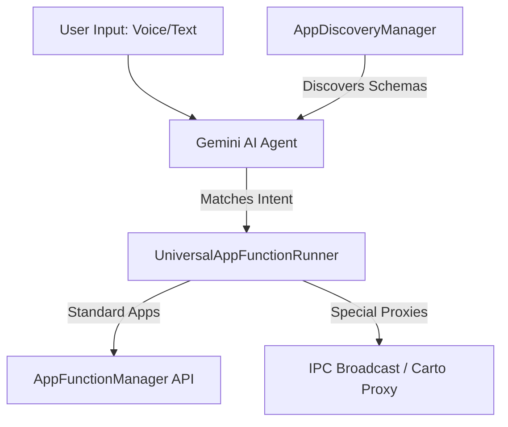

# <p align="center"></p>

# <p align="center">Aivo: Universal AI App Function Orchestrator</p>

<p align="center">
  <strong>Aivo</strong> is a state-of-the-art AI Assistant application designed to discover, orchestrate, and dynamically execute Android App Functions across all installed applications on a device. It bridges the gap between natural language user intents and structured application logic.
</p>

---

## ⚙️ How It Works

Aivo acts as an intelligent orchestration layer on top of the Android system, utilizing a three-stage runtime flow:



### 1. Dynamic App Function Discovery
Using the `AppDiscoveryManager`, Aivo scans the device for services responding to the `android.app.appfunctions.AppFunctionService` intent. It fetches function schemas, simple names, parameters, and types dynamically.
*   **Compile-Time Metadata Extraction**: Leverages standard App Functions APIs.
*   **APK Fallback Parser**: Includes a robust fallback parser to extract compiled schemas directly from package APK manifests for development.
*   **Context Control**: Provides toggle switches on the dashboard to enable or disable specific apps from the AI's vocabulary.

### 2. AI Intent Mapping
Aivo streams the active function schemas to an LLM reasoning engine (`GeminiAiAgent`). The agent translates user natural language commands into a structured function call containing the target package, function simple name, and JSON arguments.

### 3. Universal Execution Runner
The `UniversalAppFunctionRunner` executes the structured function call:
*   **Standard Execution**: Invokes Android's native `AppFunctionManager` for standard system and third-party app functions.
*   **IPC Proxy Execution**: Employs a custom broadcast/messenger proxy mechanism to route executions safely into isolated external environments (like the Shopify `Carto` runtime proxy).

---

## ✨ Rich UI & Interaction Features

*   **Interactive Options Picker**: Parses variant requests (like size, color, quantity) from AI outputs and renders a custom picker Card with selectable chips, sending selections back in a single formatted input.
*   **Network Image Fetching (Coil 3)**: Uses a dedicated OkHttp network engine to fetch and display image previews.
*   **Visual Voice Recorder**: Captures speech input with real-time waveform visualization, matching speaking volume level parameters.
*   **Smart Connectivity Observer**: Detects offline/online transitions, disabling interactive panels when disconnected, and displays a green emerald "Back Online" success notification with slide/fade entry-exit animations.

---

## 🛠️ Technology Stack
*   **Core Architecture**: Kotlin Coroutines, Flow, StateFlow, Android Architecture Components.
*   **UI Framework**: Jetpack Compose, Material 3, custom Compose Animations.
*   **Media & Networking**: Coil 3 (Multiplatform network module), OkHttp.
*   **App Orchestration**: Android App Functions SDK, IPC Messenger Services.

---

## 🚀 Getting Started

### Build Requirements
*   Android SDK 34+
*   JDK 17
*   Gradle 8.5+

### Compile Project
```bash
./gradlew assembleDebug
```
